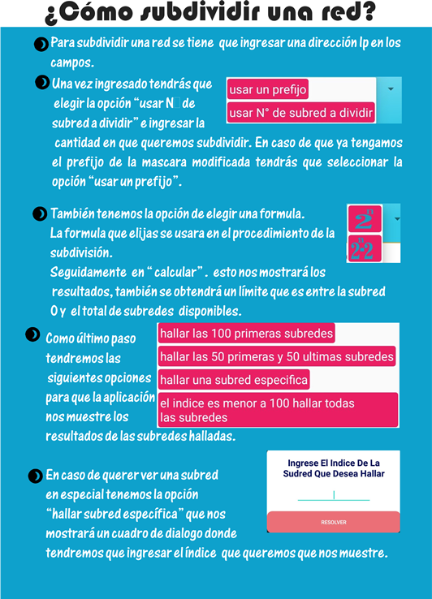
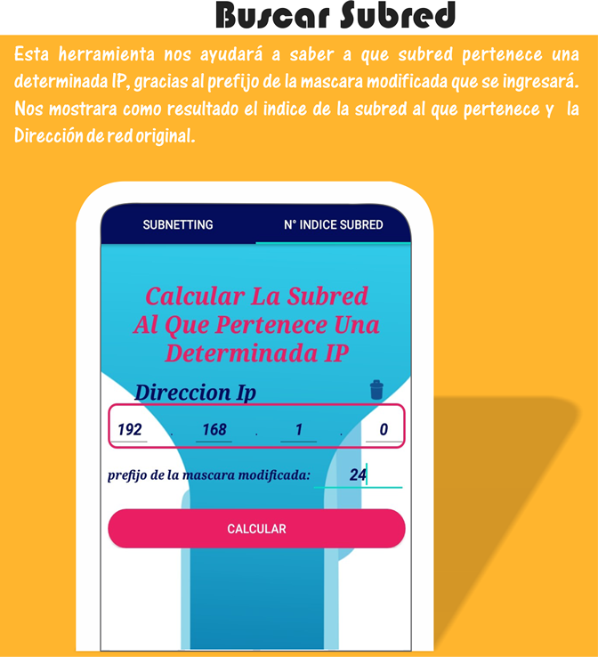
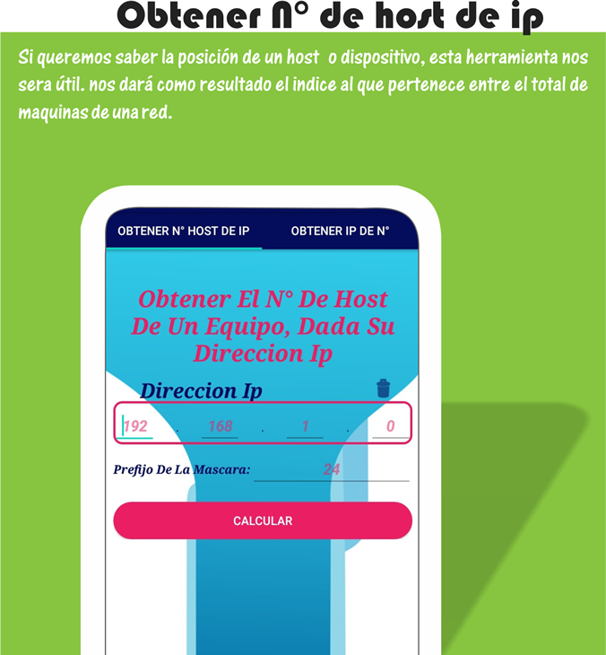
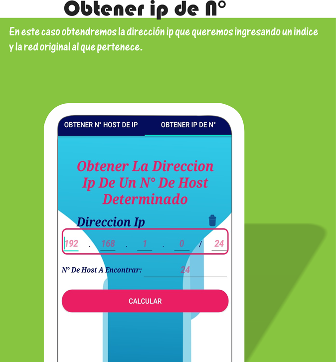

# Calculadora de Subredes

Aplicación Android desarrollada para facilitar el cálculo de subredes a partir de una dirección IP y máscara de red. Ideal para estudiantes, técnicos o profesionales que trabajan con redes y necesitan una herramienta rápida y eficiente.

## 📱 Características

- Cálculo de subredes basado en IP y máscara.
- Interfaz sencilla y amigable.
- Navegación intuitiva con pestañas.
- Resultados detallados con dirección de red, primer host, último host, y broadcast.
- Compatible con versiones antiguas de Android (minSdk 14).

## 🧑‍💻 Tecnologías Usadas

- Java
- Android SDK
- AndroidX Navigation
- Material Design

## 🚀 Capturas de Pantalla

| Pantalla Principal | Resultados | Navegación |
|--------------------|------------|------------|
|  |  |  |

| Cálculo en Proceso | Más Resultados | Más Funciones |
|--------------------|----------------|----------------|
|  |  |  |

## 📄 Cómo Usar

1. Ingresa una dirección IP válida.
2. Selecciona la máscara de red deseada.
3. Presiona calcular.
4. ¡Listo! Se mostrará toda la información relacionada con la subred.

## 🛠 Requisitos

- Android Studio Arctic Fox o superior.
- SDK mínimo: 14
- SDK objetivo: 33

## 🧠 Créditos

Desarrollado por Raul Hacho Cutipa.  
Proyecto educativo y práctico para el curso de Informática en redes.
